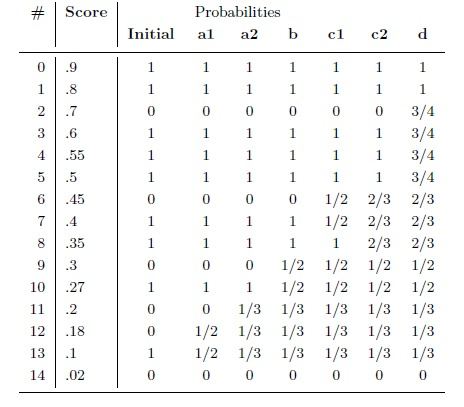
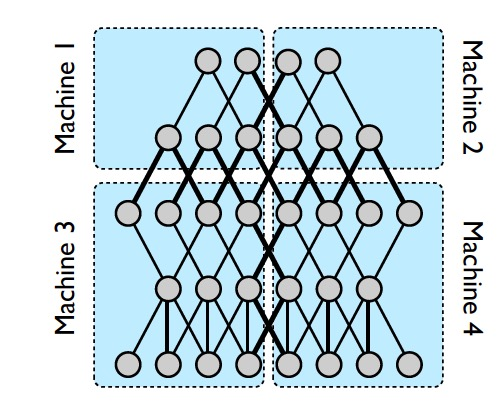

Papers reading
=====

#### Deep learning via Hessian-Fress optimization ####

　　本文主要是基于Hessain-Free提出一种可行的、易于实现的，以及对大数据友好的训练算法，该训练算法主要是用来训练深度学习模型-深度自动编码器。

　　神经网络的参数学习机器学习里面参数学习最麻烦的问题之一，早起的神经网络主要是通过前向传播 和 后向传播的方式来进行参数学习，这种方法对于神经网络深度不是特别深的时候[比如3层等]，还是容易学习到模型比较好的参数；但是，当神经网络往深度方向发展的时候，这种方式就不具有一般适用性了，由于梯度消失问题，会导致离输出结果比较远的层次的地方，参数更新会非常缓慢，导致模型还没有收敛就迭代结束[一般的模型都设置有最大迭代次数]，使得模型欠拟合。

　　梯度下降是优化问题中求解比较常见的方法之一，但不是最有效的方法。在面对神经网络、尤其是深度神经网络这种需要大数据量才能发挥模型的优势的时候，梯度下降会更加显得力不从心；这个主要原因是因为梯度下降算法只考虑一阶导数的方向，虽然在每次选择步长的时候，可以通过搜索的方式选择最优步长，但是实际上每次的方向是固定的，这就限制了下降的方向只可能是一阶导数的方向，虽然我们看到下降的方向是比较快的了，但是这仍然不是最快的。

　　这就引出了结合二阶导数来帮忙控制下降的方向，我们在高中课本都学过，在极小值点，对应的二级导数为0；二阶导数控制下降的方向的方式是$$ x\_{n+1} - x\_{n} = \frac{f^{'}(x\_n)} {f^{''}(x\_n)} $$，
从这个公式我们可以看到，下降的方向仍然是和梯度的方向有关，但是这个梯度方向会受到二阶导数来控制，使得下降的方向比原来纯梯度的方向选择更加准确，这就像我们下山的时候，最陡的方向一定下山最快的方向。各种拟牛顿方法都是使用上面的变种来进行优化求解的。

　　上面的“二阶”方法使得训练的时候，能够用更少的迭代次数使模型达到收敛，那么神经网络学习里面能不能也使用这种方式来减少迭代次数呢？答案当然是可以的，但是这种方式也是有缺点的，就是计算和存储二阶Hessain矩阵的代价还是比较大的，尤其是针对参数很多的时候，这种方式运算和存储的代价会越来越大。Hinton &　Salakhutdnov 2006, Bengio 2007 使用layer-wise的非监督预训练的方式，在真正使用SGD方法之前进行一些数据的预处理，使得在模型训练的时候能够加快速度，同时也避免因为直接计算Hessain矩阵导致开销。

　　这篇paper就是基于二阶导数的方式进行改进，使得在相对较少的迭代次数下能够使模型达到收敛；这种少的迭代次数使得模型在大数据集上训练成为现实，这正是深度[神经]学习所需要的。

　　具体的做法是基于Hessain-Free的方法进行方法和一些细节地方的改进，算法的训练流程如下：

使得二阶Hessian能够适用于Deep network的模型训练的方式有一下几个方面：

1. 针对Hessain-Free的改进，串通Hessian-Free的方式是$$$ Hv $$$，而本人的第一个改进就是通过引入Damping，使得Hessian-Free变为 $$$ Hv + \lambda v $$$，参数 $$$ \lambda $$$是用来控制有多近似，和传统的拟牛顿法相对[因为神经网络的优化问题是非凸优化，通过添加这么一个参数，使得我们有多大程度相信这个二阶导数去控制梯度的方向是可信的]；

    选择$$$ \lambda $$$比较著名的方式为Newton-Lanczos，本文只是简单的用以下方式确定:    
    $$$ if \rho \lt \frac {1} {4} : \lambda \gets \frac 2 3 \lambda \qquad elseif \, \rho \gt \frac 3 4 : \lambda \gets \frac 3 2 \lambda $$$，这个是使用的Levenberg-Marquardt风格的方式来启发式调整$$$ \lambda $$$的值，其中$$$ \rho $$$为    
    $$ \rho = \frac {f(\theta + p) - f(\theta)} {q\_{\theta}(p) - q\_{\theta}(0)} $$

2. Hessain-Free的乘积计算，也就是计算$$$ Hv $$$，Pearlmutter(1994)已经提到了一种快速计算$$$ Hv $$$的方式；另外一种计算方式是"SMD"，Schraudolph(2002)对Pearlmutter的方法进行一般化处理，使用$$$ Gv $$$来替代$$$ Hv $$$，其中$$$ G $$$是通过Gauss—Newton近似的方式来近似Hessian；

    本文也是使用$$$ G $$$ 来替代$$$ H $$$的，目的是$$$ G $$$ 能保证是半正定的；同时这种方式在后面使用CG计算p的时候，对于任何正数$$$ \lambda $$$都有效。至于为什么使用G在深度学习的二阶优化中，可以阅读文章Mizutani & Dreyfus(2008)。

3. 针对大数据集的处理，及时是相对容易计算$$$ Hv $$$，但是当数据集增大到很大的时候，计算所花的代价仍然是不容小觑的；一种方式使用顺序的mini-batch[顺序的意思是每次使用不同的mini batch来进行对参数更新]，本文没有使用这种方式，主要原因是因为这会带来$$$ B $$$的变化，而这个变化又会导致求具体方向$$$ p $$$的方法CG的不稳定性；

    本文使用的方式是使用一个相对较大的mini-batch(比如和模型参数大小差不多)来计算Hessain-Free的$$$ B $$$，然后在全量数据上计算梯度和损失；每一轮HF迭代都会有上百轮的$$$ Hv $$$的计算和一轮梯度计算，但是即使这样，和SGD方法相对，我们的算法迭代仍然很少有超过200轮的。

4. 求解每一轮参数更新方向的CG算法的停止条件，CG(conjugate gradient)方式是用来计算$$$ B = Hv + \lambda v $$$和梯度共同确定参数求解下降方向的值的优化算法，选择p的方式是使得$$ \parallel Bp + \triangledown f(\theta) \parallel \_2 \lt \varepsilon $$，
常规的选择方法是$$$ \varepsilon = min(\frac 1 2, \parallel \triangledown f(\theta) \parallel \_{2} ^{\frac 1 2}) \parallel \triangledown f(\theta) \parallel \_2 $$$。

    本文CG迭代i停止条件是:    
    $$ i \gt k \, and \, \phi (x\_i) < 0 \, and \, \frac {\phi (x\_i) - \phi (x\_{i-k})} {\phi (x\_i)} \lt k \varepsilon $$，
    其中$$$ k $$$是我们需要从当前迭代向前看对应的值，$$$ k = max(10, 0.1i) $$$，且$$$ \varepsilon = 0.0005 $$$

5. 在迭代之间共享信息，也就是上一次迭代的结果可以直接作为下一次迭代的输入信息，CG优化时仍然可以使用上一次最后的结果作为初始的迭代信息，这样做的目的是因为这个方向最有可能是优化下降的方向，减少盲目从零开始对优化进行尝试。
6. CG迭代的回溯(backtracking)，[这个没大看得懂，]
7. Precondition CG，使用$$$ \hat{x} = Cx $$$来替代$$$ x $$$，也就是使用Precondition来加速CG方法的求解。
8. 随机初始化，使用自己提出的"sparse initialization"来进行参数权重的初始化；

#### Fast Curvature Matrix-Vector Products for Second-Order Gradient Descent ####

#### Ad click Prediction: A view from Trenches ####

google的paper，主要从工程角度讲解FTRL如何工作，以及如何选择合适的参数，算法步骤描述如下:

关于$$$ \alpha $$$ 和 $$$ \beta $$$的工程选择，

#### Estimating Conversion Rate In Display Advertising from Past Performance Data ####

　　来自于美国企业Dsp公司turn的paper，主要说明dsp中cvr预估模型，模型采用的组合模型，最后使用logisitcs regression来进行ensemble的；前面各个weak estimator则是使用分层结构(hierarchy)的方式训练各个模型的。

　　Dsp中的CTR预估和CVR比一般的ADN或者sponsored Search Advertising都要苛刻得多；CVR的值预测高了，会导致广告主浪费不必要的预算在无效的广告展示上；如果预测低了，使得广告主会丢失掉一部分"高价值"的展现。

　　对于在模型训练和矫正的时候，对应的cvr的值是相似用户聚集在一起的cvr的值，这样的好处是避免某一个广告在单独的用户上的cvr值过低，同时也不会因为把广告所有的conversion放在一起计算导致对实际模型预测的不准确。

　　展示广告分为三个类别，user、publisher、advertiser，对应的Data hierarchy如下:

　　显示或者隐式的数据聚类(cluser)则是利用这种hierarchy来进行聚类进行统计或者weak estimator的模型计算的；这样是基于用户行为去聚类数据，而不是用用户本身的属性(age\sex)等去聚类的，这种聚类方式不是使用算法上注入kmeans等方式来聚类的，而是直接根据{user, publisher_category}等方式来聚类的；这种方式的缺点是需要预先对上图的Data Hierarchy进行处理，比如publisher的hierarchy的组织，比如User cluster的组织，并且最终结果的正确性为严重影响最终cvr预测的准确性。

　　[PS.]用户的聚类已经有很多研究方法了，比如[Classification of proxy labeled examples for marketing segment generation]学习一组DNF规则集来最大化发生conversion用户的覆盖率[?]，[Scalable distributed inference of dynamic user interests for behavioral targeting]则使用潜在语义分析模型LDA来进行无监督的用户聚类操作，并且每个用户cluster都有用户有关的兴趣。

　　这篇文章考虑的独立estimator是基于(user, publisher, advertiser)不同层次来进行操作的，不同层次都可以训练出来一个弱的模型，然后用所有这些弱的模型在logistics regression上组合(ensemble)一下，组织成强cvr预测模型。这种层次组织的弱模型有以下两个问题:

1. 数据稀疏问题，也就是在某个层级上，没有足够的正负样本的数据来计算当前弱模型下的cvr的值；但是这种情况随着层级的上升，相对会变得不那么严重一点；
2. 弱模型本身的问题，也就是某个弱模型训练的结果严重偏离了实际的预测值，文章是说丢弃那些不相关的弱模型，但是没有说怎么丢弃；

　　当得到所有的弱模型之后，我们在logistics regression上直接线性组合一起，并计算对应的参数即可。这里使用logistics regression的目的是为了预测对应conversion=1的概率值，而不只是得到一个转换成功的布尔值。

　　实际模型训练中其他一些有用的"招术":

1. Data Imbalance:

    分以下两种情况：    
   	*. 平均转化率本身就很低，并且我们始终没办法得到足够多的数据；
   	*. 正负样本的比例值很低，但是我们已经拿到"足够"多的数据

   	对于第一种情况，当数据不够足以支撑模型训练的时候，我们可以使用规则的方式人工构造一个规则模型来替代训练模型；对于第二种数据倾斜比较严重的数据集，可以通过精确分析的方式[Issues in mining imbalanced data sets - a review paper && Mining with raity: A unifying framework]进行区别对待。这篇文章使用AUC指标来进行模型评估，数据倾斜对AUC没有较大的影响，但是为了减少内存使用，仍然只是使用了较多类别的数据的一部分来进行模型训练。

   	数据采样时采用的分层采样的方式对数据进行采样操作。

2. Output Calibration

	因为模型训练的时候，由于主动[内存控制]和被动[样本确实]原因，导致训练并没有完全使用全量的训练样本来训练。使得模型预测的CVR的值并不是真正的预测值，需要通过修正的方式对预测的cvr值进行修正[这个修正不是每个都有必要的]，这篇文章得到修正方式是:$$ \hat{p}^{Test} \approx p(Y^{Test} = 1 \mid v\_i \le p^{pred} \lt v\_{i+1}) = \alpha \hat{p}(v_i) + (1 - \alpha)\hat{p}(v_{i+1}) $$，或者使用PAVA[Isotone optimization in r: Pool-adjacent-violators algorithm and active set methods]来对$$$ \hat{p}(v_i) $$$的修正。

3. Missing features

	一种是使用mean或者median来填补缺失值[离散缺失值，如何修补]，或者使用BLSE(bayesian least squares estimator)来对缺失值进行弥补操作，计算方式通过简单的高斯条件分布，由非缺失值来计算缺失值：$$ \hat{\tilde{p}}\_{BLSE}^{sm\_s} = \hat{\mu}\_ms + \hat{\sum}\_{m\_{s}o\_s}(\hat{\sum}\_{o\_s})^{-1}(\hat{\tilde{p}}^{so\_s} - \hat{\mu}\_{o\_s}) $$。

	其他的填补缺失值的方式有，SVD，GMM(Guassian mixture modeling)，CF等方式。

4. feature selection

	数据的预处理 ==> 分析数据以及观察数据属性统计情况；同时会丢弃掉那些超过65%的值都缺失的特征；同时也会丢弃掉方差过小的属性。[离散的特征和连续的特征的处理方式是不一样的]；

#### calibaration of machine learning model ####

　　由于模型在训练的时候采用的是采样方式对模型进行训练，以及其他原因诸如模型本身的问题[比如sigmod函数更倾向于拟合到sigmod曲线上去]，导致训练之后的模型，在预测的时候对应的预测值，跟真实的潜在分布或者概率值存在不一致的情况，而很多时候，我们又需要尽量去接近真实的分布情况，比如在ctr中，预测出来的ctr值是希望跟真实值比较接近，以便能够在后续ecpm或者其他排序等操作的时候，能够到真实的预估值；

1. 分类模型的评估指标有：accuracy、f-measure、macro-average
2. 概率分类模型：正确分类的比例值、logloss、MSE、Berier score、ROC
3. 回归模型：MSE、MAE(absolute)

　　即使是在评估指标相同的情况下，不同的模型仍然有不同的错误分布；这种错误分布会导致在预测的时候会出现这样或者那样的问题，而我们希望的是模型预测的和实际值比较接近；因为出现了这种偏差，所以我们需要对模型进行做出改变，一种方式是重新设计更好的模型分布以便能够获得更精准的概率或者数据分布；另外一种方式就是这里提到的Calibration method，通过对训练之后的模型进行校正的方式，使得得到的模型尽量接近真实分布，通过校正的方式，来纠正的模型有：决策树、神经网络、核方法、instance-based method、bayesian nethod等等；同时，不同的模型、任务，对应的校正方法又是不完全一样的；

校准问题的分类$$$ ^{[1]} $$$：

##### calibration measure #####

常见的measure metrics:

##### solution #####

　　针对CD问题的calibration，当预测分类的比例和真实比例不一致的时候，可以通过改变阈值的方式来修复这个问题，但是同时会引起其他问题[比如，设置阈值为$$$ r = p(a|x)/p(b|x) $$$]。

　　而针对CP问题的话，则要求的技术会复杂得多；(DeGroot& Fienberg, 1982)提供了通过图形分析的方式进行校正，对应的图形描述如下：

　　上图中，左图是没有校正的分类预测的概率值，右图为校正之后的模型；对应的方式将预测的概率等分为10等分，然后统计每个分类间隔里面的均值(mean)，并绘制成对应的左图；常见的处理方法有：

1. binning average

	(Zadrozny& Elkan, 2001)，首先将预测的概率排序，然后将这些排序好的概率值分桶到k个箱里面去，然后用这个同里面的均值来代替校正的这个区间段的值。

	按照预测值划分等长的n个区间并统计断点处的真实CVR值，对于一个预测值落在[Vi,Vi+1)的新样本，使用两个端点的统计值平滑得出最终预估值。由于某些bin样本过少导致的预测值的非单调性，再使用Isotonic Regression对端点统计值做后处理$$$ ^{[2]} $$$。

2. isotonic regression

	给定一个无序的序列，通过调整的方式，调整为非递减的有序序列，同时使得平方误差最小，也就是我们说的保序回归。最基本的做法对序列违反"非递减"的对进行平滑处理，处理的方式为$$$ p^{\*}(i,j) = p^{\*}(i + 1, j) = \frac {p(i, j) + p(i + 1, j)} {2} $$$

	PAVA算法，算法的步骤如下：

	

	这个地方需要解释几个内容，$$$ \hat{m\_{i, i}} $$$是初始值，因为初始值分组的时候，只有一个，所以只有一个，而在合并的过程中，相邻的两个区间每一个都会有多个，上下两个区间的范围分别为[k, i)和[i, l]，如果这两个区间的值违反了，对应的计算方式为所有的$$$ y[实际的值-0,1] $$$之和 除以 这两个相邻区间的合并长度；实际的一个计算例子如下：

	

	当实际计算完成之后，记录每个合并之后区间的预测概率值和对应的step wise值，当需要在预测的时候进行校正的话，使用者校正值即可；$$$ \hat{m}(f) = \hat{m\_{i,j}}, \, for \, f\_i < f < f\_j $$$

3. Platt‘s method

	参数方法，通过sigmod函数来拟合预测的概率和校正的概率，校正方式为$$$ p^{\*}(i, j) = \frac {1} {1 + exp^{A \times p(i, j) + B}} $$$，参数A和B通过最小损失的方式来获得，比如最大似然方式[对应的优化最小值通过取负号即可]；

4. 其他方法

	针对决策树的curtailment (Zadrozny & Elkan,2001)方法，使用父节点来替代叶子节点比较小的情况[比如叶子节点数目比较少]；以及paper$$$ ^{[3]} $$$。
	
	Google的论文，对CTR的平滑方式，使用Possion分布来对预测概率进行校正$$$ ^{[4]} $$$。

这些处理方法的目标都是转换预测的概率值到校正之后的概率值，同时注意这些方法在二分类里面可以直接使用，是因为二分类问题可以直接通过概率进行排序操作；

　　部分内容[参考链接](http://onslaughtor.github.io/prediction-model-calibration/)。

#### Issues in Mining imbalanced data ####

　　针对imbalanced data的方法进行的review，对当前的一些方法进行梳理，以及简要描述未来的趋势；

　　标准的机器学习方法，因为在以下几个方面的原因，导致在imbalanced data上表现不好：

1. Accuracy，由于所有的影响程度一样，少数类在准确率上发挥的作用相当微小；
2. Class distribution，当前算法是假定预测数据和训练数据分布是一样的；
3. Error Costs，不同类别的损失是一样的；

##### 应对方法 #####

　　数据层面 和 算法层面都有涉及，数据层面主要是对数据进行重抽样，而算法层面则是在损失函数上进行改进；

　　数据层面的方式分为上采样(up-sampling) 和 下采样(down-sampling)，上采样是少数样本进行重复的方式，使得数据不具有imbalanced的问题；下采样则是减少多数样本的数据量，使得数据在训练时尽量平衡；或者是这两种方式的比例融合。

　　另外一个方面则是针对不同的类别使用不同的损失函数，对少数样本预测错误产生更大的损失值；实验已经证明，数据采样 和 改变惩罚函数，都是为了调整决策阈值(decision threshold)。

　　就以下几个问题进行未来可能方向的一个说明：

1. 什么时候imbalanced data会影响？
2. re-balanced是否有必要? 50:50就一定是最终分布么？
3. 是否有算法对imbalanced data不那么敏感？

数据不平衡的天性：

1. 本身数据就是不平衡的，比如欺诈数据；
2. 数据不是自然不平衡的，但是获取少数类别的数据代价非常高；

不同的算法在imbalanced data上的问题：

采样方法：

上采样会增加训练样本，同时因为数据是重复的，容易导致模型过拟合；下采样则相反，可能因为样本丢失导致模型训练不够；

训练算法：

NN，神经网络，倾向于认为少数样本为噪音或者离群点，会导致对这些点无视，需要结合采样方法；

DT(C4.5), 由于少数样本容易出现在末端，不剪枝的要比剪枝的表现好；

#### Large Scale Distributed Deep Networks ####

using large-scale clusters of machines to distribute traing and inference in deep networks which is caleed DistBlief;

software framework(DistBlief):

1. enables model parallelism within a machine and across machines -- via message passing;
2. manage detail of parallelism, synchronization and communication;
3. support data parallelism;
4. Downpour SGD, sandblaster L-BFGS；

##### model parallelism #####

主要是前面介绍的Down-pour SGD 和 sandblaster L-BFGS方法；

总结下来，就是下图所示，如何在framework层面使得模型能够并行，以及模型上下层之间交互，使得能够在参数特别大的时候能够进行自动scale，以及参数使用parameter-server的方式实现快速收敛；他们更多的工作是在工程上如何实现，如何实现lock-free或者近似快速的模型训练，而不影响最终的训练结果；

#### Reference ####
[1] http://onslaughtor.github.io/prediction-model-calibration/    
[2] Estimating Conversion Rate in Display Advertising from Past Performance Data    
[3] Practical Lessons from Predicting Clicks on Ads at Facebook    
[4] Ad Click Prediction : a View from the Trenches Categories and Subject Descriptors    
[5] 

