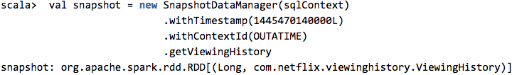

### Netflix - time machine for feature generation

> 为了使得模型试验快捷、方便、统一，netfix建立的针对特征的统一系统-time machine，减少不一致代价，加速模型迭代开发

#### 为什么建立time machine ####
　　对于模型的实验线下、线上的操作方式，一般的做法是:

- 先在线下基于历史数据进行"点子"的实验，查看该"点子"是否在历史数据上有效;
- 如果有效的话，则推到线上去进行A/B实验，进行online观察，如果观察继续有效的话，则推广这个效果；
- 如果没有效果的话，则分析为啥无效，然后进行下一次"点子"的迭代；

　　对于这种模型迭代实验的方式，主要的还是数据，当数据足够好，当数据准备得足够好－比如线上、线下一致等，模型才会有可能发挥它的功效；

1. 对于数据足够好，是指的模型验证的数据是线上客观的数据，而不是作弊的数据，不然的话，会被数据进行误导，这个要求算法工程师对数据有足够好的敏感性，要能够定义好合适的问题以及使用合适的数据；
2. 对于数据的准备，我们常说的ＭＬ模型，是在一堆数字表上进行数学优化等操作，优化和选择合适的模型和参数的，而实际中的数据，有各种各样的数据，有数字的、非数字的，离散的、连续的数据，我们需要多或者少地对这些数据进行转换操作，转换为模型能够处理的"特征向量"数据；这个转换过程，我们常称作特征工程，那么必须要求offline和online是一致的，当数据很多的时候，这样的一致性保证会增加很多无形的困难；同时如果直接使用线上的微服务，是不是会给线上的微服务加重负担；

　　其他方面的原因有，如果我们离线测试比较好之后，对于新的模型和新的特征，我们是不是需要在线上再实现一遍，回头发现不好，那么线上实现的这些功能和代码是不是直接就被"丢弃"了。

基于以上的种种原因，我们希望新设计出来的系统能够平衡实验 和 利益方面(时间成本、开发代价等)，我们对新的系统要求如下：

- 能够快速地从"idea"到online A/B测试的迭代；
- 能够直接使用线上微服务提供的数据，但是又不会给他们增加太大的负担；
- 能够精确地代码线上对应时间点的状态，用于表示线上当前正在使用时的状况；
- 能够同时给所有的算法使用者使用，而不用增加额外的准备工作；
- 能够同时在交互环境，notebook、批处理环境下运行良好，即要求系统能够适应各种数据处理的环境；
- 对于新添加的特征函数或者其他特征代码，只允许添加一次，也就是实验的时候添加的特征处理函数，能够直接给线上使用，而不用花时间排查线上和线下是否一致；
- 最重要的是，不允许出现矛盾的事情(比如: 不允许target label出现在特征中)；

netfix称这个系统为time machine-时光机器，能够一致保存当前"context"状态，同时方便算法使用者只关注算法的实验情况和online A/B实验的结果，而不用关注其他底层或者辅助功能相关的东西。

#### 如何建立time machine ####

　　在线上的time machine中，我们有几个不同的组件，用于对线上服务的快照操作：

- 选择合适的context数据进行快照操作；
- 给定的context，快照数据需要能够包含多个不同的微服务的数据；
- 通过api查询历史的快照数据；

##### context的选择 #####

　　对所有context数据进行快照的代价还是非常昂贵的，同时也是没有必要的；常见的做法是，选择预先设置好的context进行持久化操作，由于不同的算法或者在不同的数据[数据在context中]上进行训练和验证，为了能够处理所有这些情况，我们从hive中查询所有试验对应需要的context配置，然后根据这些context配置，将这些context的数据持久化到集群中；[这里需要注意的是，可能预先定义一个常用的context或者试验配置，然后开始进行基于context的数据持久化操作，但是如果我们需要试验的数据在当前都没有配置的话，那么我们需要在hive中配置好试验需要的context，然后才能持久化数据，以及持久化数据之后的各种试验验证操作]

持久化数据操作的方式如下：

##### 数据快照 #####

　　这个组件是选定的几个context，然后从对应的微服务获取数据并进行快照保存操作；netflix有一套基于云端部署的细粒度服务架构[这种架构的好处是给定的context进行数据操作会非常方便]；有很多微服务模块都是直接为模型提供输入特诊给定，比如观看历史、我的播放列表以及评分预测模块等。

　　netflix使用内部开发的组件，诸如Eureka、Hystix、Archaius来从在线的微服务获取数据，但是这些数据获取模块都是以数据块的方式获取数据的[bulk-load]，这种数据获取方式的特点是需要较大的内存以及较长的启动时间来汇集数据；这种数据汇集方式还有一个缺点是不利于在其对应的JVM中处理，而在外部创建一个jar包来运行spark任务的话，会使得和其他的netflix库不兼容[?有很强的耦合性，不利于本身netfix的库升级或者spark的uber jar升级]。对于这个难题，通过一个中间层即可解决，即使用Prana，作为spark处理的netflix生态系统数据的data proxy。

　　spark处理context的数据通过并行地访问Prana，而Prana又是直接从多个微服务按照context进行数据获取。spark和Prana之间是通过thrift来进行通信的，然后通过spark的处理，将这些快照数据持久化存储到S3中，存储方式是使用列压缩范式的Parquet.

[PS. 这里说使用的而是Prana获取数据，但是没有说Prana是怎么获取数据的，是实时的，还是其他方式？从描述来讲，可能是实时的，因为没有使用现成的bulk-load的方式]

　　数据质量对于模型的正确性来说是至关重要的，对于每一个快照，我们都存储了数据的置信情况，包括数据获取成功的比例[失败包括获取超时以及服务失败]，这些信息都提供给实验者，用于信息参考。

　　以上的context select和数据快照都是周期运行的，基于这样一个基础的需求，我们建立的一个通用的工作流和调度框架Meson，他也可以用于machine learning的pipeline调度优化，并准备将Meson进行开源了。

##### API方式的数据访问 #####

　　我们建立的API的数据访问方式，通过制定timestamp以及数据的context，就可以对数据进行访问，在spark shell下是RDD的方式返回数据查询结果:

下图为time machine的整个运行方式，spark在其中的作用为: 从实验中选定contexts, 然后对这些选定的数据进行快照存储，同时提供API方式的数据查询:

#### DeLorean: 基于Time machine的特征生成 ####

　　Delorean是netfix内部系统，用于进行给定的实验配置，然后及时的从快照拉取实验所需要的所有数据，然后生成特征和标注，以及训练模型；也就是Delorean是一个实验管理系统，通过这个系统，算法者不用关注数据是怎么拉取的，只需要配置实验以及实验所需的数据，配置特征处理方式，就可以进行模型的探索和验证了。

###### 运行实验 #####

通过DeLorean，算法研究者可以运行一系列的数据实验，而不用关注在time machine中如何启动，需要哪些时间数据，哪些数据被检索到，以及如何组织输出结果，这些DeLorean都会自动帮你做掉，你只需要类似配置文件的方式提供一下信息即可：

- label数据，基于时间维度关联的context信息，物品信息，以及每条数据的label信息[后面会简单解释]，这些数据通常是通过hive、pig或者spark query创建的；
- 特征模型，包含需要的特征编码配置信息；
- 对于新特征的编码函数，且不在库里面出现；

　　DeLorean也支持在实验中针对新特征添加和修改新的特征编码函数，比如在Zeppelin或者spark shell中，这样可以使得在为模型生成特征的时候可以立即投入使用；如果这个新的特征编码函数很有用的话，我们会发布到库里面去，供大家使用。

DeLorean特征处理和模型训练的流程图如下:

图中绿色高亮部分对于不同的实验有不同的配置；对于特征编码，算法实验者也可以使用现有的特征编码函数组合成一个新的特征处理函数。

##### Label data and Feature encoders #####

　　DeLorean的一个重要输入时label data，label data包括context信息，物品item信息以及和label关联的生成特征信息；context信息-就像他本身暗示的那样，用来描述模型用到的上下文场景信息，比如会员资料、国家、时间、设备等信息；物品item是指用于训练、打分以及排序的项，比如视频项、位置项(第几行展示的)、搜索实体信息；Label信息，就是我们模型中常说的目标值，用于监督模型的学习，一般是和物品关联的，比如播放、喜欢某个视频与否。对于无监督学习，label是不需要的，或者指定为空即可。举个例子说明label data包含哪些信息，对于个性化排序问题，context就是会员的id、国家代码、时间信息，物品项则是视频video，label则是播放还是未播放，这些信息是通过将快照context信息和播放行为日志关联得到的。

　　一旦我们有了这些label data之后，我们需要通过这些基于context汇聚的信息，使用特征编码函数，进行特征转换，将数据转换为模型训练需要的特征；每一个特征编码函数，使用每一个目标的context，以及结合原始的数据信息，产生出一个或者多个特征数据。

　　每一个item类型、context变量、以及数据元素，都是通过数据的key进行关联的；每一个特征编码函数都有一个方法能够返回它需要处理的数据的key名称的集合，DeLorean使用这个key名称的集合进行数据类型识别、数据获取，以及传递给特征编码函数一个data map，包含所有需要处理的数据。

　　同时，我们也希望DeLorean能够尽可能的灵活，使得实验者能够使用不同类型的context、item，而不需要再特征系统中进行复杂的定制。DeLorean不仅能够用于推荐场景的试验中，也可以用于基于排序场景的[比如视频的按行排序]，甚至可以用于<查询词、国家>组对作为context、单一视频作为item的搜索场景中；为了使得DeLorean能够适应这些不同场景，它需要能够自动从label data中推导context、item的类型，以及通过feature encoder获得对应的数据key名称集合。

###### Data Element #####

　　Data element是通过特征编码转换为特征的基本元素，其中一些data是和context相关的，比如用户观看历史[因为当前状态的用户观看历史是唯一的，该值会随着时间等发生变化]；另外一些则是所有context无关的，比如视频video的元信息；这两种不同的数据处理方式是不同的。

　　对于context相关的数据，我们使用上面表述的快照数据，每一个都是通过key进行值得关联；对于每一个context，我们得到所有的值、项item以及每个context下的labels数据，每一个不同的context数据扔到不同的spark executor进行处理，不同的context可以并行地进行处理，context的数据是通过spark的RDD方式进行加载的，这种加载方式的好处是可以lazy，也就是数据到真正需要的时候才会读取相应的数据。

　　对于那些和context无关的数据，DeLorean会将这些数据分发到所有的spark executor中去；由于这些数据相对比较小，以及在一段时间内值得变化缓慢很多，我们可以通过只记录每一次更新，通过反向更新的方式，倒回到合适的版本；这些数据是通过单例模式的方式常驻于内存中，使得每一个context上的特征生成都能够立即使用到。一个完整的data map是针对context去创建的context data，它包含于context有关数据，以及共享的数据单例(与context无关的数据)。

　　一旦我们创建好特征数据之后，此时的数据是嵌套的spark DataFrame，对于某些个性化操作的程序，需要对每个context中物品项进行排序操作，所以物品项相关的特征是以context为组进行组织的，以便能够在必要时进行排序操作。最终所有的features存储在hive中，使用压缩的Parquet格式。

##### 模型训练、验证和测试 #####

　　上一步通过将数据进行特征编码转换为features之后，将数据以DataFrame的形式存储到Hive中，接下来我们就可以使用这些数据进行模型的训练、验证和测试操作了；通过在DataFrame上使用标准的schema，以便能够在机器学习算法上进行模型训练，同时在测试和验证数据上进行预测和度量；我们也使用标准的格式进行模型的序列化，可以直接将这些训练好的模型发布到线上去或者其他未来的实验使用。    
*******
【这里没有说模型的标准格式是啥？训练、测试和验证数据标准schema是指我们可以通过统一的格式进行数据和按照key的方式读取，但是模型的标准格式可能因为不同的模型方式，是不一样的，比如逻辑回归、决策树，其特征和参数取值的目的是不一样的，本文没有对这个进行说明】
*******

　　下图是我们一次完整的算法迭代操作，首先设计一个算法，然后开始搜集context数据，items、labels，接下来是生成features，然后使用features进行模型的训练和验证，然后选择最优模型，并在测试数据集上验证，一旦确定是比较重要改进的话，我们会设计A/B测试，并将新得到的模型放到线上去运行和观察结果，如果线上的评比指标仍然很不错的话，则加大使用范围，否则下线以及学习为啥不好，并继续不断迭代下一个"idea"。

##### 发布到线上 #####

　　我们建立DeLorean的目的是希望线下和线上能够共享相同的特征编码函数，而不是线下到线上的代码"拷贝"；一旦一个"idea"准备在线上测试的时候，模型则是由DeLorean来对线上该idea离线实验的那份统一的feautre配置打包而成，从而保证线上和线下的一致性。

　　在线上生产系统中的特征计算，我们是直接通过调用线上的微服务来搜集该模型所需的数据，对应搜集的那些数据则是由模型中的feature编码函数来指定的，这点和线下模型从context的快照数据中获取是有区别的；一旦我们搜集好所有数据之后，则将这些数据以data map的形式传递给特征编码函数，然后按照特征向量的方式传递给模型，然后由模型进行预测计算，然后产生相应的推荐结果：

####　结论和进一步工作 ####

　　通过指定的context对线上数据进行特定时间点的状态搜集，也就是我们常说的快照数据，使得我们能够很好的对当时的场景进行模拟和idea实验。同时spark的分布式、弹性计算的能力使得我们能够每天对成千上万的场景进行数据快照操作，以及同时进行各种不同种类的特征生成、模型实验以及大数据集下的验证。现在DeLorean已经能够在线上生产系统中进行推荐系统的A/B实验了。

　　但是，这仅仅是这种方式的开始，比如说我们现在是周期的方式进行批量快照，我们希望进一步基于事件event的快照，比如当一个特定的用户访问我们的服务，为了避免数据的冗余，我们可以直接捕获数据的变化，而不是每个时间点的数据快照。我们也计划使用time machine的能力，使得我们能够实验各种新的算法和测试方式。
　　
　　快速实验室创新文化的一种体现，idea实验时间成本是衡量我们这个架构成功与否的关键，我们会持续优化我们的基础设施，以便能够提供更好的个性化信息。

#### 读后感 ####

　　这篇文章是讲netflix怎么构建一个离线、在线统一的系统，目的是为了方便算法研究人员能够通过特征配置、特征编码的配置等比较快捷的方式进行他们的主要目的-寻找更好的模型，以便能够更好的服务推荐或者netflix其他服务。

　　文章提到了整个DeLorean大部分工作都是构建在spark上的，这也给了我们如果希望使用spark构建的一个参照，netfix使用了spark + Hive的方式构建、存储以及查询数据。

　　但是，这篇文章有些细节地方都没有提到，比如我们常说的算法的一个样本是包含多个context的，而netfix是多个context可能是使用不同的微服务来进行提供服务的，那么这些数据是如何关联的，文章只是简单的提到使用了时间，但是多个context的关联，应该不只是时间，也可能是用户id或者cookie等信息。

　　还有就是，虽然特征编码的方式线下和线上统一了，但是没有提到线上、线下模型预测是否为统一，以及如果需要编写一个新的模型处理方式的话，如何保证线下的运行和线上运行效率的保证。

　　其他的疑问是，DeLorean是基于context和特征编码函数的配置知道需要搜集和读取哪些数据的，那么每个微服务应该是context或者关联信息来标注的，不然就没办法知道需要去哪个微服务搜集数据了，另外就是每个data都是有相应的key去关联的。对于多层嵌套结构，比如搜索的时候，展现的内容是有多个item的，以及多个item都是有rank信息的，而在模型训练的时候是需要扁平化展开的，这个文章没有提及到[可能视频观影数据这种嵌套结构不是特别多]，这种数据关联时候怎么展开给模型训练使用?

　　我们说如果多个实验同时进行，在线下的时候可能不会互相干扰，但是在线上如何做到互相不干扰[这个可能是另外一个话题了]，对于这样的实验，如何在线上设计合理有效的A/B test---对于这个问题，可以部分参照google的重叠实验框架。

#### 文章来源 ####

<http://techblog.netflix.com/2016/02/distributed-time-travel-for-feature.html?utm_source=tuicool&utm_medium=referral>
