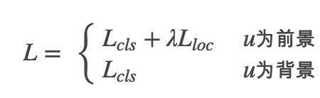
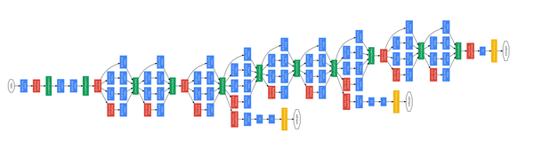

目标检测概述
======

> DL方式的目标检测    
> 脉络路线：RCNN -> SPPNET -> Fast-RCNN -> Faster-RCNN    
> 后续的：YOLO，DeepMask、SharpMask

#### 概述 ####

object detection，目标检测，

#### RCNN ####

##### 1 RCNN- regions with CNN总体介绍 #####

Regions with CNN features.

RCNN的处理步骤：

1. 选择输入的图片
2. 使用selective search对图片进行region proposals，大概有2000多个region proposals
3. 对于每个region，使用CNN进行特征转换[这里只使用到CNN的卷积层和池化层，没有使用最后一层全连接的softmax层]； -- AlexNet
4. 训练出来K个L-svm训练器，使用第3步的输入特征，得到每一个region属于每一个分类的得分；
5. 对每个类别使用NMS舍弃掉一部分region，

\[nms\]: 非极大值抑制

##### 2 Object Detection with RCNN #####

###### 2.1 模型设计 ######

1. region proposals: 可选的方法有 -- objectness, selective search, category-independent object proposals, CPMC[constrained parametric main-cuts]...，本文选择的是selective search；
2. 特征抽取，将每一个"拉取"出来的region proposal进行特征抽取，最终输出的特征维度为4096，是从原始输入为227 x 227的RGB图像中，然后经过5层卷积层和2个全连接层来进行特征的抽取；需要将输入的region proposal的图像转换为CNN的输入格式，是通过忽略size和aspect ratio来进行缩放的，warp all pixels，在warp之前，添加一个(dilate)16 x 16的边框，优点是：
3. test-time detection，

	CNN的特点是 所有的类别共享相同的参数  和  CNN计算出来的特征向量更加少；

4. 训练，

	supervised pre-traning，使用ILSVRC2012 classification数据进行预先训练；    
	Domain-specific fine-tuning，为了能够使得CNN能够进行new task或者new domain，将1000路输出替换为N + 1路输出(N类样本 和 1类背景)；使用IoU > 0.5为正样本，其余为负样本(IoU表示)，SGF的起始学习率为0.001(pre-train模型的1/10)，每一次迭代batch为128，正负样本为96:32；    
	object category classification：使用SVM进行二分类，使用IoU的值来区分正负样本也比较重要，作者是{0.1, ...，0.5的尝试}，最后选择了0.3；[IoU标注样本是如何进行的，需要有实现标记好的内容，计算的是目标标记区域 和 region proposal的重叠区域]

##### Detection error analysis #####

1. Visualization, ablation, and modes of error

	visuliztion，可视化的方式查看每层的情况；
	
	ablation：
	
	- Performance layer-by-layer, without fine tuning，这里想说明的是，用pool5，fc6，fc7的特征做SVM分类，出来的效果都差不多。作者得到的结论是：CNN的特征表达能力大部分是在卷积层。

	- Performance lyaer-by-layer, with fine tuning，这里想说明的是，pool5经过finetuning之后，mAP的提高不明显，所以卷积层提取出来的特征是具有普遍性的，而fc7经过finetuning后得到很大的提升，说明finetuning的效果主要是在全连接层上。
	
	- Comparision to recent feature learning methods,这里主要说明CNN的特征学习能力比其他方法要好。
	

2. Detection error analysis，

3. Bounding box regression，使用regression 来进行物体的进一步定位，受DPM中的regression启发，使用池化层的特征对region proposal进行位置定位；

##### Appendix #####

1. Object proposal transformations
	
	输入到CNN的大小是227 x 227，且是固定的，需要对region proposal进行转换得到CNN的输入，缩放候选方式如下
	
	
	
	A表示输入的原始region proposal, B以及后面的是缩放方式，第一行表示p=0边框，最后一行表示p=16的边框，最后作者用的是（d）的第二列的方法；
	
	各项异性缩放
	
	各项同性缩放

2. Positive vs. negative examples and softmax

	为什么训练CNN时候和训练SVM时候，使用了不同的标准来定义正负样本。感觉还是调参调出来的；
	
	CNN选择0.5， SVM选择0.3的IoU；

3. Bounding-box regression

	在region proposal中做了一次regression，

4. Selective Search for Object Recognition

#### SPPNET ####

CNN的卷积层不需要固定大小，但在全连接层需要固定大小，全连接层需要固定大小的原因是因为训练的时候需要固定参数大小，来确定每个参数的值，然后在预测的时候才能使用；但是卷积层其实不需要固定大小的。而卷积层和全连接层之间通过一个spp(spatial pyramid pooling)层来进行衔接，使得输入图片的大小不受限制。

传统的图片处理，需要通过crop 或者 warp的方式对输入的图片进行预处理；crop的图片得不到完整信息，warp图片。

spp(spatial pyramid pooling)是Bow(bagging of word)的扩展，[ssp介绍](http://blog.csdn.net/jwh_bupt/article/details/9625469)。

我的理解是通过在不同的bin上使用不同的池化策略，而这些池化策略的输出端是固定的，由于不同的尺寸对应的的池化选择的串口大小不一样，我们可以通过多个不同的bins来覆盖不同尺寸的池化要求；

如上图所示，可以通过预先预定好对应的步长，比如1x1, 2x2, 4x4的方案，使得整个全连接层的输入向量的特征为(1+4+16)x256的固定长度的特征向量，而filter到spp poolinglayer则根据每个filter的大小进行窗口和步长的设定和池化即可。

[这里金字塔的含义是自底向上是4x4，2x2, 1x1，从下往上看，很像金字塔逐层增多的结构]

如何将region proposal映射到ssp net之后的feature map，需要将region proposal中的坐标内容映射到卷积之后的features map上，实现方式是：

对于每一个region proposal，通过selective search得到标框的坐标内容，然后通过映射转换[we project the corner point of a window onto a pixel in the feature maps]计算在CNN最后一层上的坐标，得到转换之后的框的范围，然后通过这个范围计算spp net的输出值，然后就可以得到这个region proposal的特征向量。[计算出四个角点之后的坐标，就可以知道转换之后的CNN的feature map的特征位置了]

#### Fast-RCNN ####

结合RCNN和SPPNet，并解决RCNN和SPPNet的缺点，使得整个训练能够整体在一起进行训练和反馈更新；

RCNN和SPPNet的缺点：

1. RCNN是分步训练的，第一步是在CNN上使用log loss进行参数的训练；第二步是使用CNN的最后一层特征(全连接层前面一层)作为SVM的输入数据，进行fine-tunning；第三步是进行bounding box回归运算；
2. 训练太耗费时间和空间，耗费时间是因为每张图片大概有2000多个region proposal，每个RoI(region of interest)都进行一遍训练；
3. Object detection 非常慢，特征都是从每个region proposal中抽取出来然后进行训练和预测的；
4. RCNN是因为每次region proposal都是单独训练，而没有一次计算，所有的region proposal共享这一次计算，SSPNet解决了这个问题，通过spatial pyramid pooling池化层来使得所有region proposla共享一次计算；但是SPPNet也有缺点：

	训练仍然是多步，虽然CNN计算只需要一次，但是后面使用selective search得到的region proposal仍然需要每个单独计算，并且需要存储到disk上，但是CNN pre-training，SVM训练，bunding box regression仍然是分步训练；
	
##### Fast-RCNN训练结构 #####

运算流程如下：

1. 首先得到预先选择出来的region proposal，这里不是实际的图像内容，而只是region proposal的边框信息；
2. 将整张图片扔到CNN中，使用卷积层和池化层得到features map信息；
3. 结合第二步以及第一步的信息，使用第一步的信息，在第二步的features map上进行crop映射，并使用一个spp layer(RoI pooling layer)将每个proposal都转化得到一个固定尺寸的特征向量；[和sppnet的区别就是，这里不是单独的一个个做的，而是一个大的向量一次把所有的region proposals都转换出来]
4. 经过两个全连接层，并连接到两个输出，一个是分类训练，一个是bbox(bounding box) regression，进行各自的训练；分类训练使用的softmax，bbox regression使用的是smooth的L1-loss。
5. 最后到每个单独的训练器的时候，仍然添加了一层全连接层，这层全连接层的作用是?

##### RoI pooling layer #####

这种是解决sppnet 和 RCNN的关键，通过这个连接，使得能够将前面的CNN和后面的分类训练衔接起来，而不是分步进行运算[误差传播能够穿透sppnet]；

1. 将RoI映射到整张图片上的patch，即定位到整张图片进行CNN之后的feature map的位置；
2. 将定位的位置经过spp layer，将这个特征转换为固定大小feature map，使得后续的分类能够运算；

这块的细节有，paper没有提及，需要从代码中观察：

1. 如果进行单个region proposal的映射和转换，转换为固定大小的feature vector；涉及到的内容用多个filter上的操作
2. 如何进行多个的region proposal的同时运行；

fast-rcnn对BP的改进，由于整个region proposal都扔进来了，同时这些所有的region proposal合起来基本上包含了整张图片，使得整个感受野非常大，需要对SGD进行BP参数更新的时候进行一些特殊设计：

1. 每一次batch训练的时候，首先抽样N张图片，然后在每张图片上抽样R/N的region proposal，可以尽量N小，R大；[同一张图片可以共享计算的，这种方式的缺点是收敛较慢] N=2, R=128

###### multi-task loss ######

softmax输出的是每一个ROI在k+1分类上的概率；bbox regression输出的是4xN路输出，也是每个bbox的边框信息；

loss函数为：

其中bbox regression使用的修正的L1-loss

这样修正的l1-loss的目的是：模型训练对离群点更加robust；使得梯度学习不容易暴涨或者消失；

全连接层的参数初始化：The fully connected layers usedfor softmax classification and bounding-box regression are initialized from zero-mean Gaussian distributions with standard deviations 0.01 and 0.001

###### Scale invariance ######

使用两种方案来使得缩放不变性，

1. “brute force” learning，预先scale到预定义的size大小；single scale，这种方式能够明显减少训练时间，同时mAP没有明显下降；
2. 使用image pyramids

###### FC SVD ######

使用fast-rcnn，全连接层仍然很大，可以通过SVD分解来对特征输入矩阵进行裁剪，从$$$ uv $$$调整到$$$  uv $$$。

###### which layers to fine-tune

training through the RoI pooling layer is important for very deep nets.

1. 对于深层网络，仍然有必要RoI层和全连接层一起tune还是有必要的。
2. 是否所有的卷积层都需要fine-tune？答案是没有必要的，如果卷积层不参与，明显能够减少训练时间； 

增加训练数据量， During training, images are horizontally flipped with
probability 0.5。只是使用了0.5的概率对图片进行水平翻转。

单纯的增加region proposal不一定是好事，可能会导致更差的结果；

[fast rcnn 代码路径](https://github.com/rbgirshick/fast-rcnn)

#### Faster-RCNN ####

Fast-RCnn将整个训练过程连接起来了，现在的瓶颈主要在region proposal部分:

1. Region proposal 运行在CPU上，而没有运行在GPU上；重新实现在GPU上，但是重新实现在CPU上对于预测的时候：

	　　but re-implementation ignores the down-stream detection network and therefore misses important opportunities for sharing computation。

本文提出的解决方案是 -- 使用深度卷积网络来计算proposals -- Region Proposal Networks；

相对于image的pryamids 和 filters的pyramids，RPN使用"anchor" Boxes直接在feature maps上，同时作用在multiple scale和aspect ratio上，而不需要额外的image 和 filters的pyramids；

为了能够统一RPNs和Fast-RCNN，提出了training scheme使得能够在针对region proposal的fine-tuning和object detection的fine-tuning之间切换；

##### Deep networks for Object detection #####

常用的object region methods，也就是选择对象区域的方法，基于像素的分组(selective search, CPMC, MCG)或者基于滑动窗口的(objectness in windows, EgdeBoxes)；

R-CNN中 region proposal 和 后面的classifier是分开的，classifier的好坏严重依赖于前面的region proposal选取模块；OverFeat方法，使用全连接层来预测box的坐标，把全连接层变成卷积层，用来检测多个指定类型的对象；MultiBox方法使用网络的最后一个全连接层来生成 region proposals，这种方法的缺点是不能再proposal和detection网络上共享特征[为啥?]。

faster RCNN的整体结构图

和前面的rcnn、fast-rcnn不同的是Region Proposal networks部分，这里是使用RPN的方式来进行region proposals的构建；attention 机制，也就是RPN来告诉fast rcnn哪里看到的[有点像共享的意思]

[神经网络中的 attention 机制]

##### Region Proposal networks #####

输入一张图片，输出一堆候选的region proposals，并且对应矩形区域的得分，整个这个过程是使用CNN来操作的，

使用小的网络在CNN已经生成的feature maps上进行扫描，通过n x n的窗口滑动来实现，也就是选择窗口的大小，并将这个窗口的特征向量映射到一个低维特征向量上{256或者512...}，然后这个特征向量是2个全连接层 和一个ReLu层，连接的输出是2个，一个是classifier(2路输出，输出是或者不是region proposal的概率)，另外一个是回归，输出的是bounding box regression下的坐标信息；[这里的输出低维度的特征向量是在各个anchor上，即一个slide window 会有[3 x 3]路输出]，需要固定输入的特征向量的size么？

每一个滑动窗口下，同时预测多个region proposals，我们把这个称作anchor，anchor的中心是滑动窗口的中心，同时以这个为中心的有多个不同scale、不同aspect ratio的region(3 x 3种)；

anchor的平移不变性 -- 通过滑动窗口选择anchor，以及在anchor上进行多个区域的选择，这种方式具有平移不变性；由于anchor本身考虑了pyramid的功能，不需要在输入的时候或者在filter的时候进行scale然后训练，即做到了single scale, single size；

loss function，对于anchor的正负样本的标注，标注正样本的方式：

a. 对每个标定的真值候选区域，与其重叠比例最大的anchor记为前景样本 
b. 对a)剩余的anchor，如果其与某个标定重叠比例大于0.7，记为前景样本；如果其与任意一个标定的重叠比例都小于0.3，记为背景样本 
c. 对a),b)剩余的anchor，弃去不用。 
d. 跨越图像边界的anchor弃去不用

对应的loss function，同时最小化分类误差 和 位置偏差；

RPN的训练：

- 原始特征提取网络使用ImageNet的分类样本初始化，其余新增层随机初始化[高斯分布，标准差为0.01]。 
- 每一次mini batch为一张图片，每一次随机选取256个anchors，正负样本的比例为1:1；
- 前60K次迭代，学习率0.001，接下来20K次，学习率为0.0001；
- momentum设置为0.9，weight decay设置为0.0005；

共享特征如何训练，

- 轮流训练RPN和Fast-RCNN
- 近似联合训练
- 联合训练，

滑动窗口 + 多个anchor如何扔进去进行训练?

[是否需要考虑旋转不变性]，

[faster rcnn code](https://github.com/rbgirshick/py-faster-rcnn)

ZF: Zeiler and Fergus model
VGG-16

#### Appendix A: NMS ####

　　非极大值抑制（NMS）主要是为了更精确的定位某种特征，比如用梯度变化表征边缘时，梯度变化较大的区域通常比较宽，所以利用x和y方向的梯度确定一个法向arctan(y/x)，然后在法向上判断当前梯度测量是否是一个峰值（或局部极大值），如果是就保留，不是极大值就抑制（如设置为0）。这样的话就能将边缘定位在1-2像素宽（相邻像素有时候求极大值的方向恰好互不干扰）。近几年竟然还有单拿NMS的优化论文出现，可见图像处理在相当长的一段时间内进无止境啊。

　　非极大值抑制在基于RCNN的目标检测中，用于对经SVM判定为目标的重叠proposals上进行精确定位，不仅可以减少重叠proposals的输出，也可以更精细化定位目标位置和大小。

#### Appendix B: HoG and SIFT ####

##### HoG

　　HOG即histogram of oriented gradient, 是用于目标检测的特征描述子，该技术将图像局部出现的方向梯度次数进行计数，该方法和边缘方向直方图、scale-invariant feature transform类似，不同的是hog的计算基于一致空间的密度矩阵来提高准确率。Navneet Dalal and Bill Triggs首先在05年的CVPR中提出HOG，用于静态图像or视频的行人检测。

##### SIFT #####

SIFT特征不只具有尺度不变性，即使改变旋转角度，图像亮度或拍摄视角，仍然能够得到好的检测效果。

[sift说明](http://blog.csdn.net/abcjennifer/article/details/7639681)

#### Appendix C: Selective Search ####

[selective search paper阅读](http://zhangliliang.com/2014/07/17/paper-note-selective-search/)

原始论文：Selective Search for Object Recognition

#### Appendix D: concepts ####

- 微调，在整个网络结构上进行参数调整；
- Lenet，基础的深度CNN网络
- Alexnet，结构图如下

	

- GoogleNet

	

- VGG，连续conv多，

	

- Deep Residual Learning，
