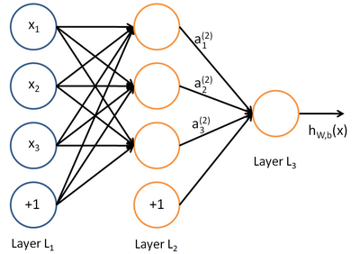

theano以及深度学习笔记
======
> deep learning以及工具theano的学习笔记


### Theano Intro ###


### Theano basic Concept ###

#### Tensor ####

　　Tensor，翻译过来叫做张量；wiki上的解释是，Tensor是一个几核表示对象，用来表示几何向量、标量之间的线性关系；而在物理学和工程学中，Tensor表示点乘、交叉乘积、线性映射以及欧式向量关系；从这个解释我们可以看出，Tensor是这样一种数据结构，用来表示数据之间的关系，而这种关系在线性代数中可以使用矩阵来进行天然的表示，同时单数据可以认为是一种特殊的矩阵，在某种意义上，我们认为矩阵和Tensor是等价的。

　　TensorVariable和TensorType是Theano中两种最基本的数据结构，Theano是符号定义的一套数学计算工具，我们假想数据的运算操作是类似于"有向无环图"的运算方式，即数据从前面的节点不断的计算，然后通过运算符(Op)以及中间节点存储数据，逐步地往后计算[这不就是神经网络中的前向传播算法么，^_^]，而在每个节点使用特定的操作符计算的时候，该操作方式没有变化的；举个例子，比如我们有一个运算符--加法，也就是 x + y，在这个运算符中，加法本身的操作方式是不会变化的，也就是针对不同的数据x, y，加法的一般性质是不会变化的，变化的一般是数据，即当前可以是 1 + 2，下一次可以是 3 + 5；另外我们看神经网络的结构图:



通过该图，我们发现，最重要的是数据在网络结构图中流动，但是每个节点的计算方式并不流动，比如说中间节点是有前面节点通过线性求和 加上 激活函数 传播得到的结果，这个计算方法并不流动；即有这样一个结论，在设计神经网络或者深度学习计算性"框架"的时候，我们假设数据是流动的，而计算方法是不流动的。

　　Theano也是基于这样一个理念[数据流动, 计算方法不流动]，来进行设计的，而TensorVariable以及TensorType是这个理念里面最重要的概念之一，即我们通过TensorType来表述计算公式里面的每个变量，也就是符号表示的方式，比如最简单的公式$$$ z = x + y $$$，这个公式里面的x，y，z就是我们说的符号表示，然后每次在计算的时候，使用不同的具体数据代入计算即可；下面是一个简单的代码例子:

```
import numpy
import theano.tensor as T
from theano import function
x = T.dscalar('x')
y = T.dscalar('y')
z = x + y
f = function([x, y], z)
f(4, 3)
```
这里定义的x, y, z都只是符号，在具体计算的时候，通过Theano.function将符号连接成一个计算公式，在具体计算的时候，调用f以及传入具体的数据即可进行实际的数据计算；

　　上面的代码例子中，x是TensorVariable的instance，T.dscalar是TensorType的一个实例；下面我们继续说明一下Tensor的创建方式以及有用的属性和方法。

##### 创建 #####

　　Theano已经预定义好了一些Tensor Type，使得我们可以直接拿来使用，这个TensorType的实例都接受一个name的参数，用于方便地进行debug调试，[how?];

　　常见TensorVariable类型有scalar、vector、row、col、matrix、tensor3、tensor4；还有一些复式构造的，即一次可以创建多个instance:

```
x,y,z=Tensor.dscalar('x', 'y', 'z')
```

　　或者就是，我们定义自己的TensorType，像定义上面scalar等一样，通过传入参数即可:

```
# system fmatrix definition:
fmatrix = TensorType('float32', (False, False))
# 括号里的false表示的是长度是否固定，false表示不固定，true表示长度为1
dscalar = TensorType('float64', ())  # dscalar definition
# custome tensor type
dtensort5 = TensorType('float64', (False,)*5)
```

　　当然，也可以从Python对象中创建TensorType，通过调用shared函数即可:

```
x = shared(numpy.random.randn(3,4))
```

##### 其他操作 #####

　　其他的支持的操作有：

1. shape & shuffling，改变维度大小和对数据进行shuffle操作；
2. reduce操作，针对各种维度的"降维"操作，比如max，min，mean，std等；
3. index操作，和Numpy类似，支持各种高级的Index操作，比如针对元素的比较操作n[n>4]，另外定义了set_subtensor、inc_subtensor等操作方式；
4. 位运算符、数学运算符的支持，比如 a & b；但不支持inplace方式的修改操作，只允许在Theano内部进行必要的inplace操作，外部使用updates参数来添加数据更新；
5. 基于每个元素的操作(ElementWise)，逐个Casting(cast, real)，逐个元素比较(le, lt, isnan...)，逐个元素条件转换(switch)，逐个元素位上的操作(and_, or_, xor, bitwise_and...)，逐个元素的数学运算符(abs_, angle, exp, maximum...)；
6. 线性代数计算，dot、outer、mgrid、ogrid；
7. 梯度、求导操作，Theano中是先声明数学计算的符号表达式的，对应的求导计算也是只返回关于符号的梯度[导数]；Theano中的梯度计算是使用级联的方式进行计算的，这样的好处是，对于每个单独的式子，单独计算各自的导数即可，而不用观察前后或者传递进来的这个导数是什么；还有另外一个好处是，由于复杂的机器学习模型都会涉及到很多参数，同质的、非同质的，我们事先针对符号进行求导推导之后，后续的我们可以一直使用同一个求导之后的表达式计算即可，方便重复利用；

gradient中的Rop和Lop的用法和作用：	    
　　Rop: 梯度右乘对应的点信息，$$$ \frac {\partial f(x)} {\partial x} v $$$;    
　　Lop: 梯度左乘对应的点信息[即点在左边]，$$$ v \frac {\partial f(x)} {\partial x} $$$;

###### ROP ######

　　其中，不同的Rop在不同的运算符上表现的方式是不一样，这里以Dot运算符对Rop举例说明：

```
from theano import tensor as T
from theano import function
import numpy as np

W,V = T.dmatrices('W', 'V')
x = T.dvector('x')
y = T.dot(x, W)
JV = T.Rop(y, W, V)
f1 = function([W, V, x], JV)

f1([[1,2],[3,4]], [[5,6],[7,8]], [0,1])
```

查看theano的源码可知，在theano.gradient的Rop函数中，构造符号输入，inputs构造输入[x, W], eval_points构造输入[zero_like(), V]，然后在具体的op中调用对应的Rop操作，这里的y的操作符dot，所以调用tensor.basic中Dot class的Rop方法进行实际调用，    
    
从图中可以看出，其中eval_points[0]为0向量，即乘以任何内容仍然是0；其实就是$$$ \frac {dy} {dW} = x $$$，所以最终的结果为$$$ x \cdot V $$$。

Rop还有一个用途是用来计算二阶Hessian矩阵和一个向量的乘积:

```
x = T.dvevtor('x')
v = T.dvector('v')
y = T.sum(x ** 2)
gy = T.grad(y, x)
Hv = T.Rop(gy, x, v)
f = function([x, v], Hv)
```

　　这个可以算是Theano的一个killer feature了，针对神经网络的参数优化求解，使用梯度下降法或者随机梯度下降法是可以求解，但是在数据量非常大的时候，这两种算法其实都没什么优势了[举个例子，如果我么有1TB的数据，迭代50次 和 迭代500次的所使用的时间，差距还是很大的，前者可以需要几个小时，后者需要几天甚至更久的时间]。

　　Hessain 乘以 一个向量vector，可以使用梯度的方式来计算，也可以使用Rop来计算：

```
x = T.dvector('x')
v = T.dvector('v')
y = T.sum(x ** 2)
gy = T.grad(y, x)
# 注意这里gy * v的顺序，gy * v 和 v * gy是不一样的
vH = T.grad(T.sum(gy * v), x)
# or using Rop
Hv = T.Rop(gy, x, v)
```

##### 跟神经网络相关的tensor操作 #####

1. conv

    signal.conv2d、nnet.conv2d，前者传统2D卷积的实现，后者是卷积神经网络上的实现(多通道池化、3D卷积)；

    针对2D神经网络或者图片的处理：
    + nnet.conv.conv2d，CPU版本的实现，标准的针对2D神经网络和多通道2D图像的实现；    
    + conv2d_fft，GPU版本，使用FFT转换的方式实现的；
    + cuda-convnet wrapper for 2d correlation，针对开源GPU版本的封装，开源版本的conv2d由Alex Krizhevsky实现；
    + GpuCorrMM，来自于caffe's CUDA的实现，Torch中也有使用；
    + CorrMM，CPU版本；
    + dnn_conv，GPU版本，使用nvidia的cuDNN库实现；

    针对3D神经网络/视频的卷积:
    + conv3D，
    + conv3D_fft, GPU only
    + GpuCorr3dMM，GPU only
    + conv3d2d

2. nnet，神经网络的非线性激活函数

	+ sigmod, ultra_fast_sigmod, hard_sigmod
	+ softplus
	+ softmax
	+ relu
	+ binary_crossentropy
	+ categorical_crossentropy
	+ h_softmax, Two-level hierarchical softmax

	sigmod和softmax是神经网络最常见的非线性激活函数，softplus和relu是为了应对"梯度消失"问题提出的激活函数，主要解决反向传播的时候梯度计算过小的问题。

3. neighbours，

	images2neibs：通过滑动窗口的循环操作方式，用于存储点周围的邻居信息，通常用于在图像操作里面进行补丁选择。

4. bn -- batch normalization
5. blocksparse

	SparseBlockGemv: 稀疏数据的点乘操作；

其他的下采样操作: downsample.fft, pool_2d

###### 随机数操作 ######

binomial、uniform、normal、random_integer、choice、possion、permutation、multinomial、shuffle_row_elements

###### compile ######

###### gof ######

###### theano sparse ######

###### Lop ######

Rop和Lop是jacobian乘以vectors，或者vectors乘以jacobian，提供这种方式的目的是避免直接先计算jacobian，而是直接用求导或者 之后的结果直接来计算向量的乘积$$$ ^{[1]} $$$。

###### Gradient ######

　　在Theano中，使用tensor.grad函数计算符号表达式的导数，传入的cost的参数值必须是标量的表达式。grad函数是Theano中比较重要的一个函数了，一阶导数、二阶导数是优化问题中最常见的内容，而grad函数又是用来计算一阶导数和二阶导数的。

```
import theano.tensor as T
x = T.dscalar('x')
y = x ** 2
gy = T.grad(y, x)
# 或者更复杂的导数
x = T.dmatrix('x')
s = T.sum(1 / (1 + T.exp(-x)))
gs = T.grad(s, x)
```

　　Theano中会在编译期间对求导数的一些不必要的计算进行优化，以便能够在计算的时候能够加快计算速度；对于比较复杂的求导的符号表达式，Theano使用自动推导的方式来计算倒是，基本介绍参见附录[gradient and differentiation]或者wiki上关于自动推导的详细介绍。

##### 图结构 #####

　　Theano是通过有向无环图的方式对符号表达式进行组织的；在使用Theano进行训练处理的时候，第一步就是需要使用符号表达式的方式写出整个所有的数学关系(就是每一步 每一步是如何关联以及计算)，像+、-、**、sum()、tanh()等操作符都会被被翻译成ops，并使用Op对象实例来表示。

　　整个数学符号表达式被称作一个图，这样的图是由Apply、Variable以及Op来组成的：    
1. Apply节点，表示在一堆变量上op操作，或者我们说Apply Node是一个包含节点，用来包含Variable 和 Op的；    
2. Op节点，表示在特定数据上的运算操作，比如加操作；注意不同的Op操作对应的数据需求是不一样的，即结果的输入和输出都是多样性的；    
3. Variable节点，数据的符号节点，用来表示数学运算的输入和输出类型，这里当前只是用符号来表示输入和输出的类型，在具体计算的时候才会把值传入进去；

　　下面以一个简单的例子来说明图结构以及图结构一些内部操作:

```
import theano.tensor as T
x = T.dmatrix('x')
y = T.dmatrix('y')
z = x + y
```

对应的图结构如下：


对上图的几个说明如下：    
1. 蓝色的方框表示Apply Node	
2. 绿色的圆表示Op Node	
3. 红色的圆角矩形表示的是Variable Nodes	
4. 紫色的圆角矩形表示的类型    

　　当我们创建跟多的Apply Node，并通过Variable Node将这些Apply Nodes都联结起来的时候，就形成了一个完整的有向无环图；使用owner属性来将中间"Variable"来指向这种Apply Node，通过这个Apply Node的输入和Op运算得到的输出[或者换个说法就是，中间Variable节点是通过owner属性执行生成该节点的Apply Node]；Apply Node的inputs和outputs都可以是多个，x、y节点的owner为None，因为他们是直接变量，而不是某个计算结果的输出，如果他们是某个计算结果的输出，那么表现方式就会变得和z一样。

```
x = T.dmatrix('x')
y = x * 2
y.owner
y.owner.inputs
y.owner.outputs
y.owner.op.name
y.owne.inputs[1].owner.inputs
```

PS. 这里的第二个参数不是为2，而是定义的一个中间的Variable Node，其owner实一个Apply Node，对应的Op是DimShuffle，对应的inputs[0]是Constant(2.0)，这样做的目的是将这个节点通过broadcast扩展为和x一样的结构[行和列大小一样]，这样恒方面进行ElementWise的计算[缺点是耗费了一定量的存储空间]。

　　Varaible中海油一个index属性，这个属性是当Varaible是中间节点的时候，我们需要知道当前Variable节点是对应的Owner输出的哪一个index，所以在Owner中用一个index来记录在owner.ouputs中的位置。

　　在编译[通过function来完成]成为实际的计算的时候，会添加一下额外的信息；并且在开始编译的时候，都是拷贝一份副本进行计算，避免对原始的用户的graph进行修改；每一个variable都有一个clients属性，用于记录当前对象是在graph中哪里使用，如果长度为0，表示没有在图中使用，有两种有值的clients：    
1. 第一个元素是一个Apply Node；    
2. 第一个元素是string的output，表示是function的输出；    

　　有了这种图的结构之后，使用链式法则进行导数的自动推导就会变得简单得多；我们只需要从输出开始遍历图的每个Apply节点即可；而自动推导的规则可以参见附录做一个简单的了解。

theano.function的其他几个比较有用的特性：

1. 如果输入相同的话，几个输出同时计算 ==> theano.function([a,b], [diff, abs_diff, diff_squared])
2. 设置默认值，f = function([x, In(y, value=1)], z)
3. 使用共享变量：

    ```
    from theano import shared
    state = shared(0)
    inc = T.iscalar('inc')
    accumulator = function([inc], state, updates=[(state, state+inc)])
    ```

    共享变量在function中会被改变值的，如果有对共享变量操作的话，且改变是in-place；如果不希望改变，则可以通过在given参数里面传递；

4. 函数拷贝，new_accumulator = accumulator.copy(swap={state:new_state})
5. 使用随机数，在编写符号表达式的时候，对应的内容仍然都是符号，可以通过创建随机变量的Variable，使得在实际计算的时候能够使用:

	```
	from theano.tensor.shared_randomstreams import RandomStreams
	from theano import function
	srng = RandomStreams(seed=234)
	rv_u = srng.uniform((2,2))
	rv_n = srng.normal((2,2))
	f = function([], rv_u)
	g = function([], rv_n, no_default_updates=True)
	```

theano.function是theano中最重要的一个功能，模型的权重更新就是通过这个来衔接数据与符号形式的权重更新函数，而符号的权重更新函数则由对应的梯度方法来取得(梯度下降法、随机梯度下降法)，对应的代码样例如下：

```
# 权重参数和偏置参数的梯度，用于后续的权重更新
g_W = T.grad(cost=cost, wrt=classifier.W)
g_b = T.grad(cost=cost, wrt=classifier.b)
updates = [(classifier.W, classifier.W - learning_rate * g_W),
           (classifier.b, classifier.b - learning_rate * g_b)]
# 通过function实现数据、权重更新的连接
train_model = theano.function(
    inputs=[index],
    outputs=cost,
    updates=updates,
    givens={
        x: train_set_x[index * batch_size: (index + 1) * batch_size],
        y: train_set_y[index * batch_size: (index + 1) * batch_size]
    }
)
# 具体的数据调用，而对应的权重通过shared_variable的方式，使得变量能够inplace的方式进行更新
minibatch_avg_cost = train_model(minibatch_index)
传入的index是对应的某一次的批量处理
```

##### Condition #####

ifElse And Switch:

```
from theano import tensor as T
from theano.ifelse import ifelse
import theano, time, numpy

a,b = T.scalars('a', 'b')
x,y = T.matrices('x', 'y')

z_switch = T.switch(T.lt(a, b), T.mean(x), T.mean(y))
z_lazy = ifelse(T.lt(a, b), T.mean(x), T.mean(y))
```

区别:

1. 两个语法都是基于符号表达变量操作的；
2. ifElse使用boolean值作为判断条件，输入是两个变量；
3. Switch使用tensor作为判断条件，以及使用两个变量，且他是elementwise的，即每个元素各自比较和存储；

##### Loop #####

```
import theano
import theano.tensor as T
k = T.iscalar("k")
A = T.vector("A")
# Symbolic description of the result
result, updates = theano.scan(fn=lambda prior_result, A: prior_result * A,
                              outputs_info=T.ones_like(A),
                              non_sequences=A,
                              n_steps=k)
# We only care about A**k, but scan has provided us with A**1 through A**k.
# Discard the values that we don't care about. Scan is smart enough to
# notice this and not waste memory saving them.
final_result = result[-1]
power = theano.function(inputs=[A,k], outputs=final_result, updates=updates)
```

 　　scan中的lambda的参数顺序是固定的:

1. 第一个参数是sequence的序列;
2. 第二个参数是输出信息output_info，为上一次匿名函数(或者具名函数)返回的结果，或者初始的值(3);
3. 紧接着是non-sequence的值。
4. 如果其中某一个参数没有值，则后续参数跟上即可。


 　　scan返回的是一个元组，包括结果值result，以及dict形式的updates；result包含每一步运算的结果，如果需要拿到最终结果，通过result[-1]即可，同时theano会做相应的优化，如果不需要中间结果的话，则不保存所有计算结果，这个对于大容量数据计算的时候非常有帮助；updates则表示的是上一次迭代计算的结果(参数更改的结果)，像前面的例子，需要使用上一次的累加结果，那么在使用function进行compile的时候需要把scan返回的update传递回去。下面是一个gibs sampling的例子，同样需要传递进去updates参数：
updates是dict的子类，用来记录所有共享变量的变动情况，包括输入的non_sequences变量；[ps. updates在大部分情况为空，需要手动在返回的时候添加第二个元组的元素]

```
W = theano.shared(W_values) # we assume that ``W_values`` contains the
                            # initial values of your weight matrix
bvis = theano.shared(bvis_values)
bhid = theano.shared(bhid_values)
trng = T.shared_randomstreams.RandomStreams(1234)
# OneStep, with explicit use of the shared variables (W, bvis, bhid)
def OneStep(vsample, W, bvis, bhid):
    hmean = T.nnet.sigmoid(theano.dot(vsample, W) + bhid)
    hsample = trng.binomial(size=hmean.shape, n=1, p=hmean)
    vmean = T.nnet.sigmoid(theano.dot(hsample, W.T) + bvis)
    return trng.binomial(size=vsample.shape, n=1, p=vmean,
                     dtype=theano.config.floatX)
sample = theano.tensor.vector()
# The new scan, with the shared variables passed as non_sequences
values, updates = theano.scan(fn=OneStep,
                              outputs_info=sample,
                              non_sequences=[W, bvis, bhid],
                              n_steps=10)
# 将scan的updates传递到function中去
gibbs10 = theano.function([sample], values[-1], updates=updates)
```

scan中strict=True参数，所有需要的Shared Variable都是non-sequence；

多路输出，以及several taps values[可以理解为自定义顺序，比如处理自己定义的时间顺序等]；假设我们要用scan计算下面的内容：
$$ x(n) = tanh(wx(n-1) + W\_1^{in}u(n) + W\_2^{in}u(n-4) + W^{feedback}y(n-1) ) $$
$$ y(n) = W^{out}x(n-3) $$

使用taps的scan代码如下，taps表示的是需要处理一个sequence，但是这个顺序不是默认的0,1,2这种累加的顺序，而这个顺序是通过taps来自定的；这个在深度学习中常见于RNN中，因为他是与时间顺序有关的。

```
W = T.matrix()
W_in_1 = T.matrix()
W_in_2 = T.matrix()
W_feedback = T.matrix()
W_out = T.matrix()
u = T.matrix() # it is a sequence of vectors
x0 = T.matrix() # initial state of x has to be a matrix, since
                # it has to cover x[-3]
y0 = T.vector() # y0 is just a vector since scan has only to provide
                # y[-1]
([x_vals, y_vals], updates) = theano.scan(fn=oneStep,
                                          sequences=dict(input=u, taps=[-4,-0]),
                                          outputs_info=[dict(initial=x0, 
                                          taps=[-3,-1]), y0],
                                          non_sequences=[W, W_in_1, W_in_2, W_feedback, W_out],
                                          strict=True)
```

scan中的条件结束，使用until:

```
def power_of_2(previous_power, max_value):
    return previous_power*2, theano.scan_module.until(previous_power*2 > max_value)
```

### 具体的内容学习 ###

顺序从基础的算法演化到复杂的DL。

#### 逻辑回归 ####

　　logistics regression是最基础的监督性学习方法之一，对应的有二分类和多分类问题[softmax]，这里使用逻辑回归作为最基础的例子，是因为逻辑回归的样子很像是神经网络输出的时候的样子，或者说没有隐藏层的样子；而多分类softmax则类似于神经网络中的一个线性隐藏层 加一个argmax的激活函数。通过逻辑回归我们可以理解Theano如何用前向和后向的方式来进行模型的计算和权重参数的更新。

　　这里，我们只说明softmax，因为二分类问题是softmax问题的一个特例。对于softmax，预测的概率形式如下：
$$ P(Y=i|x, W, b) = softmax\_{i}(Wx + b) = \frac {e^{W\_{i}x + b\_i}} {\sum \_{j} e^{W\_{j}x + b\_j}} $$，对应的预测分类为:
$$ y\_{pred} = argmax\_iP(Y=i|x, W, b) $$

　　在代码中，比较关键的几个的定义是[这里定义关键的含义是指通过这几个参数可以简单的串联起模型的训练和预测]：    
1. 参数 W 和 b 的定义，需要定义这两个参数的类型，矩阵或者向量的大小，其中W为n_in和n_out，前者表示输入特征的数量，后者表示输出的数量[因为是softmax，定义输出的维度是多个]，对应的矩阵为n_out x n_in，这里使用W的转置表示，即n_in x n_out，这种方式是把W当做被乘数，使得数据输入 input dot W表示data_num x n_out；对应的偏置项b为1 x n_out;    
2. 数据输入，模型的训练少不了数据的输入的，数据输入的格式可以为csv、libsvm或者其他各种各样的数据，只需要能够解析正确即可；    
3. 损失函数 和 预测函数的定义，前者用于参数的前向传播算法的更新，后者用于模型校验和预测的时候使用；以及在必要的时候定义错误函数，该函数用于统计模型的准确率等信息；    
4. 最后，当然少不了模型的训练，这里使用的批量的方式来进行权重迭代更新的，以及通过判断停止条件来判断模型训练何时能够结束；

以上4点的代码记录如下：

```
# 定义基础的参数变量
self.W = theano.shared(
    value=numpy.zeros(
        (n_in, n_out),
        dtype=theano.config.floatX
    ),
    name='W',
    borrow=True
)
# initialize the biases b as a vector of n_out 0s
self.b = theano.shared(
    value=numpy.zeros(
        (n_out,),
        dtype=theano.config.floatX
    ),
    name='b',
    borrow=True
)
# 定义计算方式以及对应的损失函数、error函数
self.p_y_given_x = T.nnet.softmax(T.dot(input, self.W) + self.b)
return -T.mean(T.log(self.p_y_given_x)[T.arange(y.shape[0]), y])
return T.mean(T.neq(self.y_pred, y))
# 定义预测函数
self.pred = T.argmax(self.p_y_given_x, axis=1)
# 数据的load，此处省略
# 定义模型训练的损失函数，以便能够通过前向反馈传播进行权重更新
cost = classifier.negative_log_likelihood(y)
index = T.lscalar()test_model = theano.function(
    inputs=[index],
    outputs=classifier.errors(y),
    givens={
        x: test_set_x[index * batch_size: (index + 1) * batch_size],
        y: test_set_y[index * batch_size: (index + 1) * batch_size]
    }
)
validate_model = theano.function(
    inputs=[index],
    outputs=classifier.errors(y),
    givens={
        x: valid_set_x[index * batch_size: (index + 1) * batch_size],
        y: valid_set_y[index * batch_size: (index + 1) * batch_size]
    }
)
# 定义更新函数，以便每次传递数据进去进行训练的时候能够进行权重更新
# compute the gradient of cost with respect to theta = (W,b)
g_W = T.grad(cost=cost, wrt=classifier.W)
g_b = T.grad(cost=cost, wrt=classifier.b)
# start-snippet-3
# specify how to update the parameters of the model as a list of
# (variable, update expression) pairs.
updates = [(classifier.W, classifier.W - learning_rate * g_W),
           (classifier.b, classifier.b - learning_rate * g_b)]
# compiling a Theano function `train_model` that returns the cost, but in
# the same time updates the parameter of the model based on the rules
# defined in `updates`
train_model = theano.function(
    inputs=[index],
    outputs=cost,
    updates=updates,
    givens={
        x: train_set_x[index * batch_size: (index + 1) * batch_size],
        y: train_set_y[index * batch_size: (index + 1) * batch_size]
    }
)
```

　　这个代码只是说明一下逻辑回归一个处理流程是怎么样的，在实际的操作过程中，需要添加正则化避免模型过拟合；另外一个是因为更新方式是使用梯度下降，梯度下降本身的缺点是没办法避免的；如何利用其它方式进行计算，也是一个潜在需要考虑的。其它的需要考虑的是，神经网络本身的一些调参等经验，比如初始值的选择，贪心训练等，后面到神经网络的时候，再专门记录和说明。

#### 多层感知机MLP ####

　　相比于逻辑回归，多层感知机(Multi layer perceptron)会复杂一点，中间会多一个隐藏层；MLP的结构图如下：


　　对应的模型输出的数学表达式为：$$ f(x) = G(b^{(2)} + W^{(2)}(s(b^{(1)} + W^{(1)}x))) $$

　　得益于theano的链式求导法则，对于这种通过层与层之间的连接的神经网络，通过theano本身支持的链式求导法则，可以直接在对应的参数上求导即可，然后theano自己会利用链式求导法则进行链的求导以及对应的求和计算，具体的链式求导可以阅读附录的[gradient and differentiation]。

　　关于神经网络求导的链式法则的公式推导，这里给出一个自己的推导过程，建议学习的时候自己在纸上手动推导一遍，比只是看会加深认识得多：


　　首先，简单定义下前向传播的过程，也就是输入层到隐藏层，隐藏层到输出层的过程；

\begin{eqnarray}
z^{(2)} = W^{(1)}x + b^{(1)} & \newline
a^{(2)} = f(z^{(2)}) & \newline
z^{(3)} = W^{(2)}a^{(2)} + b^{(2)} & \newline
h\_{W,b} = a^{(3)} = f(z^{(3)})
\end{eqnarray}

　　对于反向传播的时候，主要分两种情况，一种是隐藏层到输出节点，另外一种是中间隐藏层之间的计算[包括输出层到隐藏层]；对于问题的求解，我们一般都是使用的迭代的方式进行求解，即我们得定义好损失函数，然后通过在损失函数上进行梯度下降的方式迭代求解即可[神经网络的优化问题不是一个凸优化问题，这本身是因为多层非线性的转化，所以有时候会陷入到一个局部最小值，而非全局最小值]。

　　[反向传播进行梯度更新的时候，是如何进行优化的，多层之间的值 是可以冗余使用的]

　　常见的损失函数有0-1损失、绝对值损失、平方误差损失、逻辑损失等，这里以平方损失作为例子对反向传播算法进行说明。

损失函数的定义如下：

$$$ J(W,b) = \frac {1} {m} \sum\_{i=1}^{m}J(W, b;x^{(i)}, y^{(i)}) + \frac {\lambda} {2} \sum \_{l=1} ^{n\_{l} - 1} \sum \_{i=1} ^{s\_{l}} \sum \_{j=1} ^{s\_l + 1} (W\_{ji} ^{l}) ^{2} $$$

其中，前一项为loss function，后一项为正则项[用于对参数进行惩罚]；对参数求偏导的一般形式为：

\begin{eqnarray}
\frac {\partial} {\partial W\_{ij} ^{(l)}} J(W, b) = [\frac {1} {m} \sum \_ {i=1} ^{m} \frac {\partial} {\partial W\_{ij} ^{(l)}} J(W, b; x^{(i)}, y^{(i)})] + \lambda W\_{ij} ^{(l)} \newline
\frac {\partial} {\partial b\_{i} ^{(l)}} J(W, b) = \frac {1} {m} \sum \_{i=1} ^{m} \frac {\partial} {\partial b\_i^{(l)}} J(W, b; x^{(i)}, y^{(i)})
\end{eqnarray}

　　我们先定义残差的形式，定义残差的目的是因为，MLP每一层的输出到activation转换都是添加了一个激活函数而已，不管是对权重参数还是偏置参数求偏导都需要先经过对激活之后的结果求偏导，那么定义这个激活输出的偏导为残差，而在需要计算权重参数W和偏置参数b的时候，则再往前进行一步简单的链式求导即可[乘积]；

对输出层的残差的为：

\begin{eqnarray}
\delta \_{i} ^{n\_{(l)}} = \frac {\partial} {\partial z\_{i} ^{n\_{(l)}}} J(W, b; x, y) = \frac {\partial} {\partial z\_{i} ^{n\_{(l)}}} \frac {1} {2} \parallel a\_{i} ^{n\_{(l)}} - y\_{i} \parallel ^2 \newline
= (a\_{i} ^{n\_{(l)}} - y\_{i}) \cdot \frac {\partial} {\partial z\_{i} ^{n\_{(l)}}} a\_{i} ^{n\_{(l)}} \newline
= (a\_{i} ^{n\_{(l)}} - y\_{i}) \cdot f^{'}(z\_{i} ^{n\_{(l)}})
\end{eqnarray}

对于中间隐藏层的残差，则利用链式的求和法则[注意，这里只推导的输出层的前一层，对于深层网络的时候，可以类推的方式求解]：

\begin{eqnarray}
\delta \_{i} ^{n\_{l} - 1} = \frac {\partial} {\partial z\_{i} ^{n\_{l} - 1}} J(W, b; x, y) = \frac {\partial} {\partial z\_{i} ^{n\_{l} - 1}} \frac {1} {2} \sum \_{j=1} ^{S\_{n\_l}} \parallel a\_{j} ^{n\_{(l)}} - y\_{j} \parallel ^2 \newline
= \sum \_{j=1} ^{S\_{n\_l}} (a\_{j} ^{n\_{(l)}} - y\_{j}) \cdot \frac {\partial} {\partial z\_{i} ^{n\_{l} - 1}} a\_j ^{n\_{(l)}} \newline
= \sum \_{j=1} ^{S\_{n\_l}} (f(z\_j ^{n\_{l}}) - y\_{j}) \cdot \frac {\partial} {\partial z\_{i} ^{n\_{l} - 1}} f(z\_j ^{n\_{l}}) \newline
= \sum \_{j=1} ^{S\_{n\_l}} (f(z\_j ^{n\_{l}}) - y\_{j}) \cdot f^{'}(z\_j ^{n\_l}) \frac {\partial z\_j ^{n\_l}} {\partial z\_{i} ^{n\_{l} - 1}} \newline
= \sum \_{j=1} ^{S\_{n\_l}} \delta \_{j} ^{n\_l} \cdot W\_{ji} ^{n\_{l} - 1} \cdot f^{'}(z\_{i} ^{n\_{l} - 1})
\end{eqnarray}

上面的残差，以及残差求和本身就是求偏导的链式的法则，这些计算求和在theano已经通过链式求和的方式来实现了，也就是我们前面介绍的符号求偏导，对于MLP，我们只需要确保整个网络能正确的连接在一起即可。

MLP的核心几个点：

1. 输入层到隐藏层的计算，定义一个Hidden Layer来实现，和前面介绍的逻辑回归类似，对应的区别是输出的数量的是隐藏层的数量，同时需要定义数据经过转换之后的output(添加或者不添加激活函数)，提供后续的连接层(更多的隐藏层)作为输入使用；
2. 隐藏层到输出层的计算，该层的输入是前面一层的输出；
3. 数据的导入，需要将数据从csv或者其他格式导入到内存中；
4. 损失函数、参数、正则化，以及反向传播的时候的参数更新：

	损失函数，需要定义最终的损失函数，最终的在反向传播的时候对参数的更新，则是依据这个损失函数来进行梯度的迭代更新的，这里使用的是逻辑损失函数。

	参数，需要定义完整的参数列表，包括所有层的参数，这样在参数求偏导的时候，能对所有的参数进行参数更新[根据前面的残差传播，这里如何进行优化，以便能够共用相关信息]；

	正则化，将这部分内容添加到最终的目标函数上去，以便实现对参数的惩罚，避免过拟合，这里结合了L1和L2的正则化；

	参数更新，定义参数更新的符号函数，主要是在cost上求梯度，以便能够实现梯度下降法的参数更新，这里是定义的updates的dict，然后将对应的更新内容传递给执行函数，由执行函数对这些"shared"变量进行更新操作；

	参数的初始化，因为神经网络本身的对称性质，我们需要在参数初始化的时候打破神经网络的这种对称性，避免只有"一半"的节点发生效用；

	tanh激活函数初始化是在[$$$ -\sqrt {\frac {6} {fan\_{in} + fan\_{out}}} $$$, $$$ \sqrt {\frac {6} {fan\_{in} + fan\_{out}}} $$$]；sigmod激活函数初始化是在[$$$ -4 \sqrt {\frac {6} {fan\_{in} + fan\_{out}}} $$$, $$$ 4 \sqrt {\frac {6} {fan\_{in} + fan\_{out}}} $$$]，对应这个数据范围取对应的均匀分布取值即可。$$$ ^{[4]} $$$

核心代码如下：

```
# class HiddenLayer
lin_output = T.dot(input, self.W) + self.b
self.output = (
    lin_output if activation is None
    else activation(lin_output)
)
# parameters of the model
self.params = [self.W, self.b]
# MLP
self.hiddenLayer = HiddenLayer(
    rng=rng,
    input=input,
    n_in=n_in,
    n_out=n_hidden,
    activation=T.tanh
)
# The logistic regression layer gets as input the hidden units
# of the hidden layer
self.logRegressionLayer = LogisticRegression(
    input=self.hiddenLayer.output,
    n_in=n_hidden,
    n_out=n_out
)
# punishment items
self.L1 = (
    abs(self.hiddenLayer.W).sum()
    + abs(self.logRegressionLayer.W).sum()
)
# square of L2 norm ; one regularization option is to enforce
# square of L2 norm to be small
self.L2_sqr = (
    (self.hiddenLayer.W ** 2).sum()
    + (self.logRegressionLayer.W ** 2).sum()
)
self.negative_log_likelihood = (
    self.logRegressionLayer.negative_log_likelihood
)
# same holds for the function computing the number of errors
self.errors = self.logRegressionLayer.errors
self.params = self.hiddenLayer.params + self.logRegressionLayer.params
# cost function
cost = (
    classifier.negative_log_likelihood(y)
    + L1_reg * classifier.L1
    + L2_reg * classifier.L2_sqr
)
test_model = theano.function(
    inputs=[index],
    outputs=classifier.errors(y),
    givens={
        x: test_set_x[index * batch_size:(index + 1) * batch_size],
        y: test_set_y[index * batch_size:(index + 1) * batch_size]
    }
)
# SGD
gparams = [T.grad(cost, param) for param in classifier.params]
updates = [
    (param, param - learning_rate * gparam)
    for param, gparam in zip(classifier.params, gparams)
]
train_model = theano.function(
    inputs=[index],
    outputs=cost,
    updates=updates,
    givens={
        x: train_set_x[index * batch_size: (index + 1) * batch_size],
        y: train_set_y[index * batch_size: (index + 1) * batch_size]
    }
)
```

#### CNN卷积神经网络 ####

　　卷积神经网络，受神经科学的启发；大脑皮层是通过一系列的神经元连接在一起的，这些神经元对一块很小区域的视野非常敏感，称这种现象为感受野，通过将所有的这些小的区域"连接"起来能够覆盖一个完整的视野；这些神经元充当了对输入空间的过滤操作，同时具有很强的局部相关性；

##### 问题记录 #####

1. 矩阵计算的时候如何确定行和列，以及dot等计算的时候，是如何进行转置，然后计算的？

	回答：正常都是按照矩阵的计算规则来进行矩阵的乘积运算，唯一的就是在一个二维数组和合适大小的一维数组间的矩阵乘积的结果是一个一维数组；


#### AutoDecoder/Stacked ####

#### RBM/DBN(Deep Belief Networks) ####

　　EM(energy model)，

　　RBM(restricted Boltzman Model)

　　DBN(Deep Belief Networks)

#### MCMC(Monte-Carlo sampling) ####

#### RNN ####

#### LSTM ####

##### 附录 #####

###### Hessian-Free method ######

　　又被称作aka truncated-Newton，在很多模型优化的问题中，Hessian矩阵是很有用的，用二阶Hessian矩阵可以永凯控制梯度下降的方向，使得在最优化问题中能够较快速的达到优化下界或者下界附近；但是由于Hessian矩阵是分别对所有参数进行二次求导得到的结果，其计算量和存储量在很多优化问题中都会耗费很多"资源"的。那么Fast Matrix$$$ ^{[1]} $$$的思想是，求Hessian矩阵的目的是为了能够更新梯度的方向：
$$ f^{'}(x\_{k+1}) - f^{'}(x\_k) = H\_k(x\_{k+1} - x\_{k}) \qquad(1) $$，
我们令$$$ \lambda v = (x\_{k+1} - x\_{k}) $$$，上式得:
$$ f^{'}(x\_{k+1}) - f^{'}(x\_k) = H\_k(\lambda v) = \lambda H\_k v \qquad(2) $$，
从这个式子我们可以得到，求解Hessain矩阵，其实是为了求解Hessian矩阵和$$$ v $$$的乘积，这篇文章就是如何能够方便地求解这个乘积，以及不用存储Hessain矩阵。[ps, 文章是使用$$$ \triangledown \_ w(w) $$$推导的]    
　　下面我们简单说明下，文章是如何推导的，对细节感兴趣的话，可以去阅读论文$$$ ^{[1]} $$$。对公式(2)整理得：
$$ Hv = lim\_{r \to 0 } \frac {\triangledown \_w (w + rv) - \triangledown \_w (w)} {r} = \frac {\partial} {\partial r} \triangledown \_w (w + rv) \, \rvert \, \_{r=0}  \qquad(3) $$，
我们可以定义一下新的计算符号:
$$ R\_v \\{ f(w) \\} = \frac {\partial} {\partial r} f(w + rv) \, \rvert \, \_{r=0}  \qquad(4) $$，
而$$$ R\\{ \triangledown \_w \\} $$$在我们要计算的$$$ Hv $$$，这样我们就将二阶导数的计算转换为在一阶导数上求一次针对r的梯度即可。在具体的运算中只需要结合R运算符，得到具体的$$$ Hv $$$计算的内容即可。

优化算法的步骤如下$$$ ^{[2]} $$$：


###### Gradient and differentiation ######

　　Theano中是使用Chain Rule对符号的有向无环图进行求导计算的，或者叫做Automatic differentiation，详细内容可以参照文章$$$ ^{[3]} $$$；这里只对其中最重要的几个结论说明，

1. 求偏导的 求和 和 乘积 规则：

    $$ \frac{\partial}{\partial a}(a+b) = \frac{\partial a}{\partial a} + \frac{\partial b}{\partial a} = 1 $$

	$$ \frac{\partial}{\partial u}uv = u\frac{\partial v}{\partial u} + v\frac{\partial u}{\partial u} = v $$

2. 基于Tree的求导 chain Rule：

    

    $$ \frac{\partial e}{\partial b} = 1\*2 + 1\*3 $$

	另外一种复杂的求导规则:

	

	$$ \frac{\partial Z}{\partial X} = (\alpha + \beta + \gamma)(\delta + \epsilon + \zeta) $$

　　通过以上两种求导规则，可以解决所有的偏导数的求导问题。而theano也正是使用这种Automatic Differentiation的方式在符号的有向无环图上进行求导操作的[上面的图也是一个有向无环图]。

#### 深度学习实践 ####

　　以上是theano的一些基本概念，这些基本概念在其他深度学习框架里面也有涉及到。下面我们是通过学习深度学习的具体知识来完善和强化Theano的学习，并在必要的时候进行Theano的源码阅读;

##### theano的logistics regression实践 #####

通过一个简单的数字识别的logisitics regression，讲解一个最基本的算法迭代运用；	

#### Theano源码阅读 ####


### 参考文件 ###

[1] Barak A. Pearlmutter, “Fast Exact Multiplication by the Hessian”, Neural Computation, 1994    
[2] Deep learning via Hessian-free optimization    
[3] [Calculus on Computational Graphs: Backpropagation](http://colah.github.io/posts/2015-08-Backprop/)    
[4] Understanding the difficulty of training deep feedforward neuralnetworks
